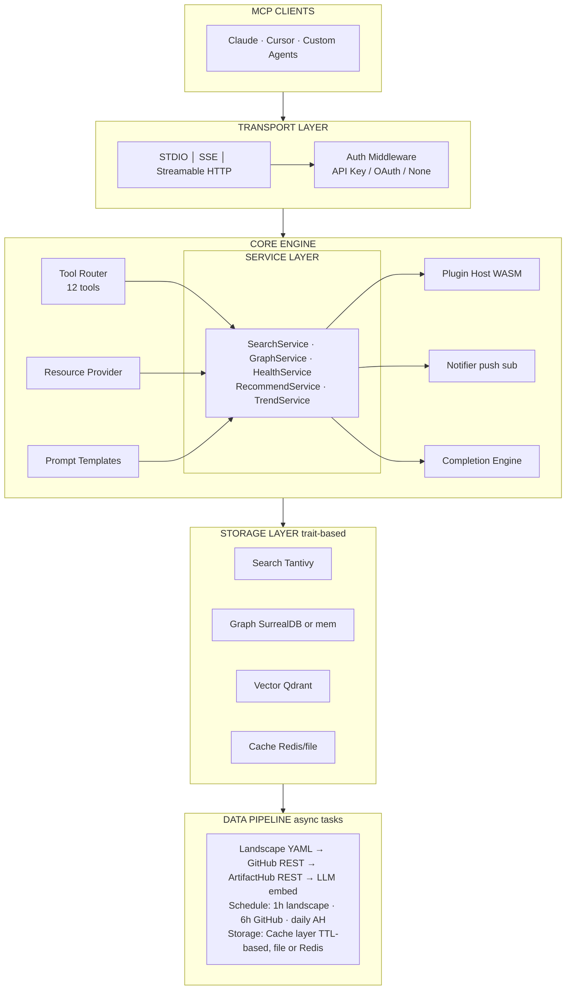
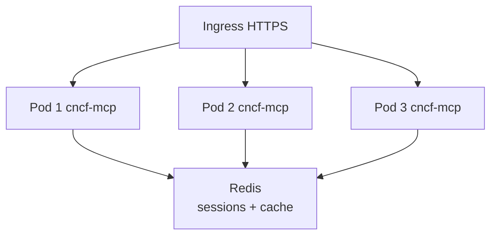
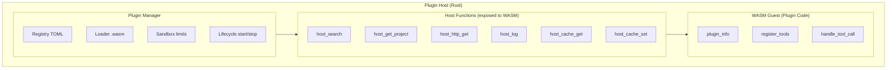
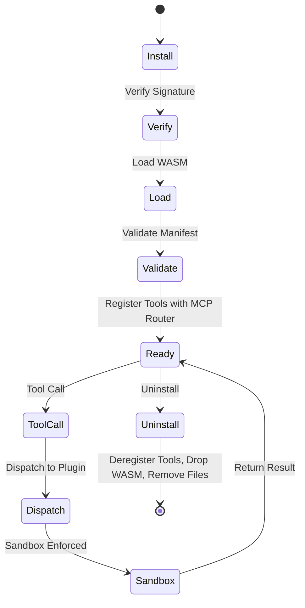
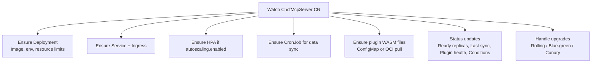
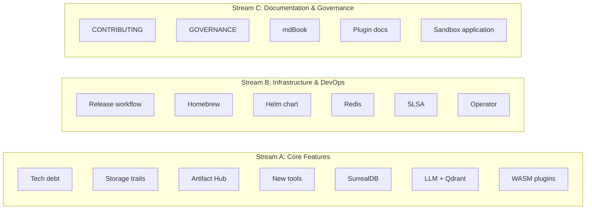
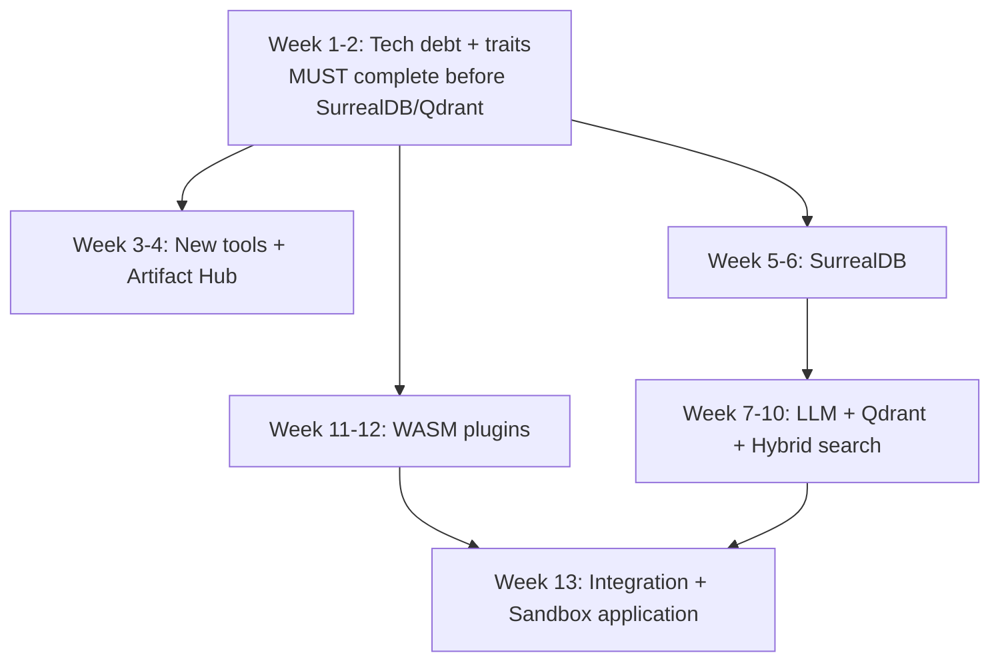

# CNCF MCP Server — Production Completion Blueprint

## 1. Gap Analysis (Brutally Honest)

### Architecture Risks

| Risk | Severity | Detail |
|------|----------|--------|
| In-memory-only state | HIGH | All projects, graph, and search index live in Arc<AppState>. No persistence layer. Server restart = full re-fetch + re-index. With 2,400 projects + GitHub enrichment this takes 2-5 minutes. |
| O(n²) graph construction | MEDIUM | ProjectGraph::build() iterates all project pairs in the same subcategory. At 2,400 projects with ~200 subcategories, this generates thousands of AlternativeTo edges on every startup. Not a problem today but will be at 5,000+ projects. |
| Single-process ceiling | HIGH | No shared state store. Two cncf-mcp pods cannot share sessions, in-flight cancellations, or subscription state. Horizontal scaling is architecturally blocked. |
| GitHub enrichment is synchronous with startup | MEDIUM | If --skip-github is not set, startup blocks on 2,400 HTTP calls (rate-limited to 5 concurrent). Cache helps, but first boot or cache expiry = slow start. |

### Security Risks

| Risk | Severity | Detail |
|------|----------|--------|
| No authentication on HTTP transport | HIGH | Anyone who can reach port 3000 gets full access. No API keys, no OAuth, no mTLS. |
| GitHub token in environment variable | MEDIUM | No sealed secrets, no vault integration. Docker compose passes GITHUB_TOKEN from host env. |
| No request signing or HMAC | LOW | Streamable HTTP sessions use random UUID — no cryptographic binding to client. |
| No rate limiting per client | MEDIUM | Semaphore limits total concurrency (50), but doesn't distinguish clients. A single client can monopolize all slots. |

### Technical Debt

| Issue | Impact |
|-------|--------|
| ~~SearchQuery.min_stars and .language~~ | **Fixed:** SearchIndex::search() now accepts min_stars and language and post-filters results; handler passes them through. |
| contributors = 0 always | GitHub contributor count requires a separate API call that's not implemented |
| logging/setLevel stores the level but doesn't rewire the tracing-subscriber filter | Level changes have no runtime effect |
| Resource subscriptions tracked but no push notifications sent | resources/subscribe appears to work but never fires |
| Protocol version in initialize response is hardcoded to "2024-11-05" even when client sends "2025-03-26" | Spec non-compliance |

### Missing Abstractions

| What's Missing | Why It Matters |
|----------------|----------------|
| Storage trait | Graph, search, and cache are all concrete types. No trait Store to swap between in-memory / SurrealDB / Redis. |
| Plugin host interface | No trait PluginHost defining the contract between core and plugins. |
| Data source trait | Pipeline directly calls HTTP. No trait DataSource for testing or swapping (e.g., local mirror for air-gapped). |
| Transport-agnostic notification emitter | Resource subscription tracking exists, but no mechanism to push events to STDIO or SSE clients. |

### Future Bottlenecks

- **Tantivy RAM index** — rebuilds on every startup. At 10,000+ projects with embeddings, RAM usage will spike. Need mmap-based persistent index.
- **GitHub API rate limits** — 5,000 req/hr authenticated. With 2,400 projects, a full enrichment cycle exhausts half the budget. Adding contributor counts doubles it.
- **No incremental index update** — any project change triggers a full re-index. Need segment-level updates.

---

## 2. Final Target Architecture



### Key Architectural Principles

- **Trait-based storage** — trait SearchBackend, trait GraphBackend, trait VectorBackend, trait CacheBackend. Local mode uses embedded implementations. Cloud mode swaps in external services.
- **Plugin isolation** — WASM guest calls host functions through a narrow ABI. Plugins cannot access filesystem, network (except declared hosts), or other plugins.
- **Notification bus** — internal tokio::broadcast channel. Resource changes, data refreshes, and plugin events all flow through one bus. Transports subscribe to it.
- **Stateless HTTP pods** — session state moves to Redis. Any pod can serve any request.

---

## 3. Phase-by-Phase Completion Plan

### Phase 1 Completion (~95% → 100%)

**Remaining items:** Homebrew formula + documentation site

**Homebrew formula:**

```ruby
# Formula/cncf-mcp.rb
class CncfMcp < Formula
  desc "MCP server for the CNCF Landscape"
  homepage "https://github.com/cncf-mcp/server"
  url "https://github.com/cncf-mcp/server/releases/download/v0.1.0/cncf-mcp-x86_64-apple-darwin.tar.gz"
  sha256 "..."
  license "Apache-2.0"

  def install
    bin.install "cncf-mcp"
    bin.install "cncf-mcp-cli"
  end

  test do
    assert_match "cncf-mcp", shell_output("#{bin}/cncf-mcp --version")
  end
end
```

**CI update:** add a release.yml workflow that builds for x86_64-apple-darwin, aarch64-apple-darwin, x86_64-unknown-linux-gnu, aarch64-unknown-linux-gnu, creates GitHub Release, and updates the Homebrew tap repo.

**Documentation site:**

- Use mdBook (Rust-native, zero JS dependency)
- Structure: docs/book/ with SUMMARY.md, chapters for: Getting Started, Configuration, Tools Reference, Resources Reference, Plugin Development, Deployment, Contributing
- CI: build on push, deploy to GitHub Pages
- **Estimated effort:** 2-3 days

**Technical debt fixes in this phase:**

- Wire min_stars and language filters into SearchIndex::search() (post-filter after Tantivy results)
- Fix protocol version negotiation — return protocolVersion matching the client's requested version
- Wire logging/setLevel to actually change the tracing-subscriber EnvFilter via reload::Handle

---

### Phase 2 Completion (~45% → 100%)

#### 2a. Storage Trait Abstraction

**New file:** `crates/cncf-mcp-data/src/storage.rs`

```rust
#[async_trait]
pub trait GraphBackend: Send + Sync {
    async fn get_edges(&self, project: &str) -> Result<Vec<ProjectEdge>>;
    async fn find_path(&self, from: &str, to: &str, max_depth: u8) -> Result<Option<Vec<ProjectEdge>>>;
    async fn stats(&self) -> Result<GraphStats>;
    async fn upsert_edges(&self, edges: &[ProjectEdge]) -> Result<()>;
}

#[async_trait]
pub trait VectorBackend: Send + Sync {
    async fn search(&self, embedding: &[f32], limit: usize) -> Result<Vec<(String, f64)>>;
    async fn upsert(&self, id: &str, embedding: &[f32], metadata: serde_json::Value) -> Result<()>;
}

#[async_trait]
pub trait CacheBackend: Send + Sync {
    async fn get(&self, key: &str) -> Result<Option<Vec<u8>>>;
    async fn set(&self, key: &str, value: &[u8], ttl: Duration) -> Result<()>;
    async fn delete(&self, key: &str) -> Result<()>;
}
```

The current in-memory ProjectGraph implements GraphBackend. SurrealDB implementation comes as a second backend.

#### 2b. SurrealDB Integration

**New crate dependency:** `surrealdb = { version = "2", features = ["kv-mem", "kv-rocksdb"] }`

- **kv-mem** for local/testing mode (replaces current HashMap)
- **kv-rocksdb** for persistent single-node mode
- Client-server mode for Kubernetes (SurrealDB as StatefulSet)

**Schema:**

```sql
DEFINE TABLE project SCHEMAFULL;
DEFINE FIELD name ON project TYPE string;
DEFINE FIELD category ON project TYPE string;
DEFINE FIELD subcategory ON project TYPE string;
DEFINE FIELD maturity ON project TYPE option<string>;
DEFINE FIELD stars ON project TYPE option<int>;
DEFINE INDEX idx_project_name ON project FIELDS name UNIQUE;

DEFINE TABLE relates_to SCHEMAFULL;
DEFINE FIELD relation ON relates_to TYPE string;
DEFINE FIELD confidence ON relates_to TYPE float;
-- Usage: RELATE project:kubernetes -> relates_to -> project:helm
--        SET relation = 'ComponentOf', confidence = 1.0;
```

**Query patterns:**

```sql
-- Get all edges for a project
SELECT *, ->relates_to->project AS outgoing,
          <-relates_to<-project AS incoming
FROM project WHERE name = $name;

-- BFS path finding (SurrealDB graph traversal)
SELECT * FROM project:$from ->relates_to->(?..$depth) project:$to;

-- Projects by category with edge counts
SELECT name, count(->relates_to) AS connections
FROM project WHERE category = $cat
ORDER BY connections DESC;
```

**Migration strategy:** On startup, check if SurrealDB is available (config flag `--graph-backend mem|surreal`). Default remains mem. When surreal is chosen, ProjectGraph::build() writes to SurrealDB instead of HashMap.

#### 2c. Qdrant + Embeddings (see Section 4 below)

#### 2d. LLM Project Summaries

**New module:** `crates/cncf-mcp-data/src/enrichment.rs`

```rust
pub struct LlmEnricher {
    client: reqwest::Client,
    api_base: String,      // OpenAI-compatible endpoint
    api_key: String,
    model: String,          // default: "text-embedding-3-small"
    summary_model: String,  // default: "gpt-4o-mini" or local llama
}

impl LlmEnricher {
    pub async fn generate_summary(&self, project: &Project) -> Result<String> {
        // Input: project name + description + README (first 2000 chars)
        // Output: 2-3 sentence technical summary
        // Rate limited: 10 req/s with token bucket
    }

    pub async fn generate_embedding(&self, text: &str) -> Result<Vec<f32>> {
        // OpenAI-compatible /v1/embeddings endpoint
        // Returns 1536-dim (text-embedding-3-small) or 384-dim (local)
    }
}
```

**Key design decisions:**

- Use OpenAI-compatible API (works with OpenAI, Ollama, vLLM, LiteLLM)
- Vendor-neutral: `--llm-api-base` flag, defaults to disabled
- Summaries cached in the JSON cache with per-project hash to detect changes
- Only re-generate for projects where description or repo_url changed
- Air-gapped: can run entirely with Ollama + nomic-embed-text locally

#### 2e. Artifact Hub Integration

**New module:** `crates/cncf-mcp-data/src/artifacthub.rs`

```rust
pub struct ArtifactHubClient {
    client: reqwest::Client,
    base_url: String,  // https://artifacthub.io/api/v1
}

impl ArtifactHubClient {
    pub async fn search_packages(&self, project_name: &str) -> Result<Vec<ArtifactHubPackage>> {
        // GET /packages/search?ts_query_web={name}&kind=0 (Helm charts)
    }

    pub async fn get_package(&self, repo: &str, name: &str) -> Result<ArtifactHubPackageDetail> {
        // GET /packages/helm/{repo}/{name}
    }
}

pub struct ArtifactHubPackage {
    pub name: String,
    pub version: String,
    pub app_version: Option<String>,
    pub description: String,
    pub repository: String,
    pub stars: Option<u64>,
    pub has_values_schema: bool,
    pub signed: bool,
}
```

Add to Project model: `pub artifact_hub: Option<Vec<ArtifactHubPackage>>`

Pipeline schedule: daily, after landscape sync.

---

### Phase 3 Completion (~5% → 100%)

#### 3a. WASM Plugin System (see Section 6 below)

#### 3b. Missing Tools

**get_good_first_issues** — new handler in `tools/search.rs`:

```rust
pub async fn handle_get_good_first_issues(params: Value, state: &AppState) -> Result<Value> {
    // 1. Filter projects by language/category from params
    // 2. For each project with a repo_url, query GitHub:
    //    GET /repos/{owner}/{repo}/issues?labels=good+first+issue&state=open&per_page=5
    // 3. Return aggregated list sorted by recency
    // Cache results for 6 hours
}
```

**get_migration_path** — new handler in `tools/recommend.rs`:

```rust
pub async fn handle_get_migration_path(params: Value, state: &AppState) -> Result<Value> {
    // 1. Look up both projects
    // 2. Find graph path between them
    // 3. Compare: category, language, maturity, features
    // 4. Generate structured migration guide:
    //    - Key differences
    //    - Compatibility notes
    //    - Step-by-step migration checklist
    //    - Common pitfalls (from curated data)
}
```

#### 3c. Kubernetes Operator (see Section 7 below)

#### 3d. Contributor Onboarding Automation

- GitHub issue templates (.github/ISSUE_TEMPLATE/bug.yml, feature.yml, plugin.yml)
- CONTRIBUTING.md with setup guide, architecture overview, PR checklist
- good-first-issue labels on 10+ issues
- GitHub Actions bot that welcomes first-time contributors

---

### Phase 4 Completion (~5% → 100%)

#### 4a. Horizontal Scaling

**Prerequisite:** Redis for shared state.

```toml
// New crate feature: cncf-mcp-core/Cargo.toml
[features]
default = ["embedded"]
embedded = []                    # In-memory everything
distributed = ["redis", "dep:redis"]  # Redis for sessions + cache

[dependencies]
redis = { version = "0.27", features = ["tokio-comp", "connection-manager"], optional = true }
```

**Move to Redis:**

- `sessions: HashSet<String>` → Redis SET `mcp:sessions`
- `request_count: AtomicU64` → Redis INCR `mcp:requests`
- `in_flight: HashMap` → Redis HASH `mcp:inflight:{session_id}`
- `resource_subscriptions` → Redis SET `mcp:subscriptions`
- Cache layer → Redis with TTL

**Scaling topology:**



Each pod has its own Tantivy RAM index (rebuilt on startup from cached data). Search is CPU-bound and scales linearly with pods. Redis handles coordination only.

#### 4b. Helm Chart

```
deploy/helm/cncf-mcp/
├── Chart.yaml
├── values.yaml
├── templates/
│   ├── deployment.yaml
│   ├── service.yaml
│   ├── ingress.yaml
│   ├── hpa.yaml
│   ├── configmap.yaml
│   ├── secret.yaml
│   ├── pdb.yaml
│   ├── serviceaccount.yaml
│   └── _helpers.tpl
```

**Key values.yaml knobs:**

```yaml
replicaCount: 3
image:
  repository: ghcr.io/cncf-mcp/server
  tag: latest
transport: sse
port: 3000
rateLimit: 50
skipGithub: false
cache:
  backend: file  # file | redis
  maxAge: 86400
redis:
  enabled: false
  url: redis://redis:6379
autoscaling:
  enabled: true
  minReplicas: 2
  maxReplicas: 20
  targetCPUUtilization: 60
```

#### 4c. RBAC & Audit Logs

**RBAC model:**

```rust
pub enum Role {
    Anonymous,   // STDIO local — full read access
    Reader,      // API key — all read tools
    PluginAdmin, // API key — install/manage plugins
    Admin,       // API key — all operations + config
}

pub struct ApiKey {
    pub key_hash: String,    // bcrypt hash
    pub role: Role,
    pub created_at: u64,
    pub expires_at: Option<u64>,
    pub scopes: Vec<String>, // optional tool-level scoping
}
```

**Audit log:**

```rust
pub struct AuditEntry {
    pub timestamp: u64,
    pub session_id: Option<String>,
    pub client_ip: Option<String>,
    pub method: String,         // "tools/call"
    pub tool_name: Option<String>,
    pub params_hash: String,    // SHA-256 of params (not the params themselves)
    pub response_code: i64,
    pub latency_ms: u64,
}
```

Emit as structured JSON to stderr (or OpenTelemetry exporter). No PII in audit logs.

#### 4d. Security Hardening (see Section 8 below)

#### 4e. Performance Optimization (see Section 9 below)

---

## 4. Qdrant + Embeddings Architecture

### Embedding Model Choice

| Option | Dimensions | Speed | Quality | Cost |
|--------|------------|-------|---------|------|
| text-embedding-3-small (OpenAI) | 1536 | Fast | High | $0.02/1M tokens |
| nomic-embed-text (Ollama/local) | 768 | Medium | Good | Free |
| all-MiniLM-L6-v2 (ONNX local) | 384 | Very fast | Good | Free |

**Recommendation:** Default to nomic-embed-text via Ollama for zero-cost, air-gapped operation. Support OpenAI-compatible API as opt-in for higher quality.

### Batch Pipeline

```rust
pub struct EmbeddingPipeline {
    enricher: LlmEnricher,
    qdrant: QdrantClient,
    collection: String,  // "cncf_projects"
}

impl EmbeddingPipeline {
    pub async fn run(&self, projects: &[Project]) -> Result<EmbedReport> {
        // 1. Compute content hash for each project
        //    hash = SHA-256(name + description + category + summary)
        //
        // 2. Check Qdrant for existing points with matching hash
        //    → Skip unchanged projects (incremental)
        //
        // 3. For changed/new projects:
        //    a. Concatenate: "{name}. {category}/{subcategory}. {description}. {summary}"
        //    b. Generate embedding via LlmEnricher
        //    c. Batch upsert to Qdrant (100 points per batch)
        //
        // 4. Delete orphaned points (projects removed from landscape)
    }
}
```

### Qdrant Collection Schema

```
// Collection: "cncf_projects"
// Vector: 768-dim (nomic) or 1536-dim (OpenAI) — configurable
// Distance: Cosine
//
// Payload:
// {
//   "name": "prometheus",
//   "category": "Observability and Analysis",
//   "subcategory": "Monitoring",
//   "maturity": "graduated",
//   "stars": 56000,
//   "content_hash": "abc123...",
//   "embedded_at": 1709251200
// }
```

### Hybrid Search (BM25 + Vector)

```rust
pub async fn hybrid_search(
    query: &str,
    state: &AppState,
    limit: usize,
) -> Result<Vec<ProjectSummary>> {
    // 1. BM25 search via Tantivy (keyword relevance)
    let bm25_results = state.search_index.search(query, limit * 2)?;

    // 2. Embed query → vector search via Qdrant (semantic relevance)
    let query_embedding = state.enricher.generate_embedding(query).await?;
    let vector_results = state.qdrant.search("cncf_projects", query_embedding, limit * 2).await?;

    // 3. Reciprocal Rank Fusion (RRF)
    //    score(d) = Σ 1/(k + rank_i(d))  where k=60
    let fused = reciprocal_rank_fusion(&bm25_results, &vector_results, 60);

    Ok(fused.into_iter().take(limit).collect())
}
```

### Drift Handling & Versioning

- Store model_name + model_version in Qdrant collection metadata
- If model changes, set a flag `needs_reembed: true` on all points
- Background task re-embeds in batches of 100, 10 req/s rate limit
- Never serve mixed-model results — if >10% points are stale, fall back to BM25-only

### Cost Optimization

- Only embed projects with descriptions (skip ~5% that have none)
- Cache embeddings in the JSON cache alongside project data
- Batch API calls (OpenAI supports up to 2048 inputs per request)
- Local model (Ollama) costs nothing — default for self-hosted

---

## 5. SurrealDB Knowledge Graph Design

### Why SurrealDB

| Factor | SurrealDB | Neo4j | In-Memory HashMap |
|--------|-----------|-------|-------------------|
| Embeddable (single binary) | Yes (kv-mem, kv-rocksdb) | No (JVM) | Yes |
| Rust-native client | Yes (first-class) | Community | N/A |
| Graph traversal queries | Native (->, <-) | Cypher | Manual BFS |
| Document storage | Yes (multi-model) | Properties only | N/A |
| Persistence | RocksDB or TiKV | Built-in | None |
| License | BSL 1.1 → Apache 2.0 | GPL (Community) | N/A |
| CNCF alignment | Neutral | Neutral | N/A |

SurrealDB provides graph queries + document storage in one embedded engine, eliminating the need for both a graph DB and a separate document store.

### Node Types

```sql
DEFINE TABLE project SCHEMAFULL;
-- Fields: name, description, homepage_url, repo_url, category, subcategory,
--         maturity, stars, forks, open_issues, language, license,
--         summary, content_hash, updated_at

DEFINE TABLE category SCHEMAFULL;
-- Fields: name, project_count, subcategories: array<string>

DEFINE TABLE artifact SCHEMAFULL;
-- Fields: name, version, type (helm|opa|olm), project_name, signed, stars
```

### Edge Types

```sql
DEFINE TABLE alternative_to SCHEMAFULL;
-- Fields: confidence: float, reason: string
-- Example: RELATE project:envoy -> alternative_to -> project:nginx SET confidence = 0.7;

DEFINE TABLE integrates_with SCHEMAFULL;
-- Fields: integration_type: string (api|plugin|sidecar|operator)
-- Example: RELATE project:prometheus -> integrates_with -> project:grafana;

DEFINE TABLE component_of SCHEMAFULL;
-- Fields: relationship: string (core|optional|ecosystem)
-- Example: RELATE project:etcd -> component_of -> project:kubernetes;

DEFINE TABLE extends SCHEMAFULL;
-- Example: RELATE project:thanos -> extends -> project:prometheus;

DEFINE TABLE supersedes SCHEMAFULL;
-- Fields: since: string (version or date)

DEFINE TABLE belongs_to SCHEMAFULL;
-- RELATE project:prometheus -> belongs_to -> category:observability;
```

### Query Patterns

```sql
-- All projects 2 hops from Kubernetes
SELECT ->integrates_with->project, ->component_of<-project
FROM project:kubernetes;

-- Shortest path between Envoy and Prometheus
SELECT * FROM project:envoy ->?..4 project:prometheus;

-- Most connected projects (hub score)
SELECT name, count(->?) + count(<-?) AS connections
FROM project ORDER BY connections DESC LIMIT 10;

-- Category ecosystem map
SELECT name, ->integrates_with->project.name AS integrations
FROM project WHERE category = "Observability and Analysis";
```

### Consistency Model

- **Embedded mode:** single-writer, consistent reads (RocksDB)
- **Client-server mode:** SurrealDB handles consistency (eventual for reads, strong for writes within a namespace)
- MCP server treats graph as read-heavy, write-infrequent (writes only during pipeline sync)

---

## 6. WASM Plugin System Design

### Runtime Choice: Extism over Raw Wasmtime

| Factor | Extism | Raw Wasmtime |
|--------|--------|--------------|
| Host function ABI | Standardized | Manual |
| Multi-language PDK | Rust, Go, JS, Python, C# | Manual bindings |
| Memory management | Handled | Manual |
| Plugin manifest | Built-in | Custom |
| Community | Active (Dylibso) | Low-level |

**Recommendation:** Extism (built on Wasmtime). Provides a stable plugin ABI, multi-language PDKs, and automatic memory safety.

### Architecture



### Plugin Manifest (TOML)

```toml
[plugin]
name = "helm-analyzer"
version = "1.0.0"
description = "Analyze Helm charts for CNCF projects"
author = "CNCF MCP Contributors"
license = "Apache-2.0"
min_host_version = "0.2.0"

[wasm]
path = "helm_analyzer.wasm"
hash = "sha256:abc123..."  # integrity check

[permissions]
network = ["artifacthub.io", "charts.helm.sh"]  # allowed outbound hosts
max_memory_mb = 64
max_cpu_ms = 5000          # per tool call
allow_cache = true

[[tools]]
name = "analyze_helm_chart"
description = "Analyze a Helm chart's quality, security, and best practices"
```

### Security Model

- **Network isolation:** Plugins can only reach hosts declared in permissions.network. The host_http_get function validates the URL against the allowlist before making the request.
- **Memory limits:** Extism enforces max_memory_mb via Wasmtime's StoreLimits.
- **CPU limits:** max_cpu_ms enforced via Wasmtime's epoch interruption. The host increments the epoch on a timer; if the guest exceeds its budget, execution traps.
- **No filesystem access:** WASM guests have no WASI filesystem capabilities.
- **Plugin signing:** .wasm files must have a matching .wasm.sig (ed25519 signature). The host verifies against a trusted public key before loading.
- **Audit:** Every plugin tool call is logged with plugin name, tool name, latency, and outcome.

### Plugin Lifecycle



---

## 7. Kubernetes Operator Design

### CRDs

```yaml
apiVersion: cncf.io/v1alpha1
kind: CncfMcpServer
metadata:
  name: production
spec:
  replicas: 3
  transport: sse
  port: 3000
  image: ghcr.io/cncf-mcp/server:v0.2.0
  cache:
    backend: redis
    maxAge: 86400
  redis:
    url: redis://redis-sentinel:26379
  github:
    tokenSecretRef:
      name: github-credentials
      key: token
  plugins:
    - name: helm-analyzer
      version: "1.0.0"
      source: oci://ghcr.io/cncf-mcp/plugins/helm-analyzer:1.0.0
  autoscaling:
    enabled: true
    minReplicas: 2
    maxReplicas: 20
    targetCPU: 60
  dataSync:
    schedule: "0 */6 * * *"    # every 6 hours
    landscapeSource: github    # github | local | mirror
```

### Reconciliation Loop



**Implementation:**

- Written in Go using controller-runtime (standard for K8s operators)
- Separate repo: cncf-mcp/operator or deploy/operator/ in monorepo
- Published as a Helm chart that installs both the CRD and the operator Deployment
- Multi-tenant: namespace-scoped CRD, operator watches all namespaces

---

## 8. Security & Compliance Plan

### SLSA Level 3

| Requirement | Implementation |
|-------------|----------------|
| Source — version controlled | GitHub, branch protection on main |
| Build — scripted, isolated | GitHub Actions, no self-hosted runners |
| Build — hermetic | Docker build with pinned base images |
| Provenance — non-falsifiable | slsa-framework/slsa-github-generator action |
| Provenance — service generated | GitHub Actions OIDC → Sigstore |

**CI addition:**

```yaml
# .github/workflows/release.yml
- uses: slsa-framework/slsa-github-generator/.github/workflows/builder_go_slsa3.yml@v2.1.0
  # (or the generic container builder for Rust binaries)
```

### Supply Chain Signing

```yaml
# Release pipeline additions:
- name: Sign binary
  run: cosign sign-blob --yes cncf-mcp-linux-amd64 --output-signature cncf-mcp-linux-amd64.sig

- name: Sign container
  run: cosign sign --yes ghcr.io/cncf-mcp/server:${{ github.ref_name }}

- name: Generate SBOM
  run: syft packages ghcr.io/cncf-mcp/server:${{ github.ref_name }} -o spdx-json > sbom.spdx.json

- name: Attest SBOM
  run: cosign attest --yes --predicate sbom.spdx.json --type spdxjson ghcr.io/cncf-mcp/server:${{ github.ref_name }}
```

### Threat Model

| Threat | Mitigation |
|--------|------------|
| Malicious MCP client sends crafted queries | Input validation, query length limits (1KB), regex-safe search |
| Plugin exfiltrates data via network | WASM sandbox, network allowlist per plugin |
| GitHub token leak | Never logged, never in MCP responses, sealed secrets in K8s |
| Denial of service via expensive queries | Per-client rate limiting (token bucket), request timeout (30s), semaphore |
| Supply chain attack via dependencies | cargo-deny in CI, cargo-audit weekly, dependabot |
| WASM plugin escape | Wasmtime sandbox (memory isolation, no WASI FS), CPU epoch limits |

### RBAC Design

| Role | Access |
|------|--------|
| Anonymous (STDIO local) | all read tools, no admin |
| Reader (API key) | all read tools |
| PluginAdmin (API key) | Reader + plugin install/uninstall |
| Admin (API key) | all operations + /admin/* endpoints |

Implemented as Axum middleware that checks `Authorization: Bearer <key>` against a config file or Redis store. STDIO mode bypasses auth entirely (local trust).

### Audit Logging

Structured JSON to stderr (or OTLP exporter):

```json
{
  "ts": "2026-03-01T12:00:00Z",
  "event": "tool_call",
  "session": "abc-123",
  "client_ip": "10.0.0.5",
  "tool": "search_projects",
  "params_hash": "sha256:...",
  "status": "ok",
  "latency_ms": 4,
  "result_count": 10
}
```

**Never log:** API keys, GitHub tokens, full query parameters (hash only), user PII.

---

## 9. Performance Optimization Plan

### Profiling Strategy

```bash
# CPU profiling (flamegraph)
cargo install flamegraph
cargo flamegraph --bin cncf-mcp -- --transport stdio --skip-github

# Memory profiling
cargo install cargo-instruments  # macOS
cargo instruments -t Allocations --bin cncf-mcp

# Benchmarks (already in place)
cargo bench -p cncf-mcp-search
```

### Tantivy Optimization

| Current | Improvement |
|---------|--------------|
| RAM index, rebuilt every startup | Mmap-persisted index in cache dir. Rebuild only when data changes (compare content hash). |
| 50MB writer heap | Tune based on project count. 10MB sufficient for 2,400 projects. |
| Parse all fields as TEXT | Add FAST flag to name for faster exact lookups. |
| Single reader | ReloadPolicy::OnCommitWithDelay for warm standby. |
| No field boosting | Boost name field 3x over description for more relevant results. |

### Async Runtime Tuning

```rust
// Current: default Tokio runtime
// Improvement: configure worker threads based on deployment
#[tokio::main(flavor = "multi_thread", worker_threads = 4)]
// For local mode:
#[tokio::main(flavor = "current_thread")]
```

Add `--workers` CLI flag. Default: num_cpus::get() for SSE mode, 1 for STDIO mode.

### Load Test Scenarios

Using k6 or wrk:

- **Scenario 1: Search throughput** — 100 concurrent clients, random queries from a word list. Target: >1000 req/s, p99 < 50ms
- **Scenario 2: Mixed workload** — 60% search, 20% get_project, 10% compare, 10% health_score. 50 concurrent clients. Target: p99 < 100ms
- **Scenario 3: Sustained SSE connections** — 1000 persistent SSE connections, 10 queries/sec each. Target: no connection drops, memory stable

### Key Optimizations (prioritized)

1. Pre-compute health scores during pipeline sync, store in project data. Currently computed on every get_health_score call.
2. Connection pooling for GitHub API client. Currently creates a new reqwest::Client per pipeline run (fine, but pool settings matter).
3. Search result caching — LRU cache (128 entries) for search queries. Most MCP clients will repeat queries within a session.
4. Lazy graph construction — build graph edges on first access, not startup. Saves ~50ms on startup for 2,400 projects.
5. Zero-copy JSON responses — use serde_json::value::RawValue for cached responses to avoid re-serialization.

---

## 10. CNCF Sandbox Readiness Plan

### Governance Model

**GOVERNANCE.md:**

- Lazy consensus for routine changes
- RFC process for architectural decisions (docs/rfcs/)
- 2/3 maintainer vote for governance changes
- Public roadmap (GitHub Projects board)
- Monthly community calls (recorded, notes published)

### Required Files

| File | Purpose | Status |
|------|---------|--------|
| LICENSE | Apache 2.0 | Done |
| README.md | Project overview | Done, needs polish |
| CONTRIBUTING.md | Contribution guide | Not started |
| CODE_OF_CONDUCT.md | CNCF CoC | Not started |
| GOVERNANCE.md | Decision-making process | Not started |
| SECURITY.md | Vulnerability disclosure | Not started |
| ADOPTERS.md | List of adopters | Not started |
| MAINTAINERS.md | Maintainer list | Not started |
| ROADMAP.md | Public roadmap | DEEP_PLAN.md exists, needs conversion |

### API Stability Guarantees

- **v0.x** — No stability guarantees. Breaking changes in minor versions.
- **v1.0** — Stable MCP tool interface. Tools may be added but not removed. Tool input schemas may gain optional fields but not remove required ones. Resource URIs are stable. Wire format follows MCP spec version.

### CNCF Sandbox Criteria Checklist

| Criterion | Status | Action |
|-----------|--------|--------|
| Open source (OSI-approved license) | Apache 2.0 | Done |
| Aligns with CNCF mission | Cloud-native + AI tooling | Done |
| 2+ maintainers from different organizations | Need to recruit | Recruit 2 external maintainers |
| Documented governance | Not started | Write GOVERNANCE.md |
| Clear project scope | DEEP_PLAN.md | Trim to SCOPE.md |
| Healthy contributor base | Solo currently | Community building needed |
| Code of Conduct | Not started | Adopt CNCF CoC |
| Security reporting process | Not started | Write SECURITY.md |

---

## 11. 90-Day Execution Roadmap

### Workstream Parallelization



### Week-by-Week Plan

| Week | Stream A (Features) | Stream B (Infra) | Stream C (Docs) |
|------|---------------------|------------------|-----------------|
| 1 | Fix tech debt: wire min_stars/language filters, fix protocol version negotiation, wire logging/setLevel to tracing | Release workflow (release.yml): multi-arch binary + container + cosign | CONTRIBUTING.md, CODE_OF_CONDUCT.md, SECURITY.md |
| 2 | Storage trait abstraction (GraphBackend, VectorBackend, CacheBackend) | Homebrew formula + tap repo | GOVERNANCE.md, MAINTAINERS.md |
| 3 | Artifact Hub client + data model extension | Helm chart v1 (basic deployment, service, ingress) | mdBook site scaffolding (Getting Started, Tools Reference) |
| 4 | get_good_first_issues tool + get_migration_path tool | cargo-deny + cargo-audit in CI, SBOM generation | Plugin Development Guide (in mdBook) |
| 5-6 | SurrealDB integration: schema, GraphBackend impl, migration from in-memory | Redis feature flag + CacheBackend impl | Deployment Guide (Docker, K8s, air-gapped) |
| 7-8 | LLM enrichment module (Ollama/OpenAI-compatible), summary generation | Docker publish workflow (ghcr.io), multi-arch images | API Reference (auto-generated from tool schemas) |
| 9-10 | Qdrant integration: embedding pipeline, vector search, hybrid BM25+vector | SLSA Level 3 provenance in release pipeline | Architecture docs, RFC template |
| 11-12 | WASM plugin system: Extism host, manifest loading, host functions, sandbox | Helm chart v2 (Redis, autoscaling, PDB) | Plugin SDK docs, example plugins |
| 13 | Built-in plugins: helm-analyzer, GitHub deep-dive | K8s operator scaffolding (Go, controller-runtime) | CNCF Sandbox application draft |

### Critical Path



### Risk Mitigation

| Risk | Probability | Impact | Mitigation |
|------|-------------|--------|------------|
| SurrealDB embedded mode performance issues | Medium | High | Keep in-memory backend as fallback. Feature-flag --graph-backend. |
| Qdrant adds deployment complexity | Medium | Medium | Make vector search optional. BM25-only mode always works. |
| WASM plugin ABI instability (Extism) | Low | High | Pin Extism version, maintain compatibility tests. |
| GitHub API rate limits during enrichment | High | Medium | Aggressive caching (6h TTL), conditional requests (If-None-Match), GraphQL batch in Phase 2. |
| Solo maintainer bottleneck | High | High | Prioritize CONTRIBUTING.md, good-first-issue labels, and community calls by Week 4. |

### Estimated Completion After 90 Days

| Phase | Current | After 90 Days |
|-------|---------|---------------|
| Phase 1: Foundation | 95% | 100% |
| Phase 2: Intelligence | 45% | 90% |
| Phase 3: Extensibility | 5% | 70% |
| Phase 4: Scale & Maturity | 5% | 50% |
| **Overall** | **37%** | **~78%** |

The remaining 22% (K8s operator maturity, multi-region, security audit, enterprise features, plugin ecosystem growth) requires community contributions and real-world production feedback — these naturally take months 4-6 beyond the 90-day sprint.
