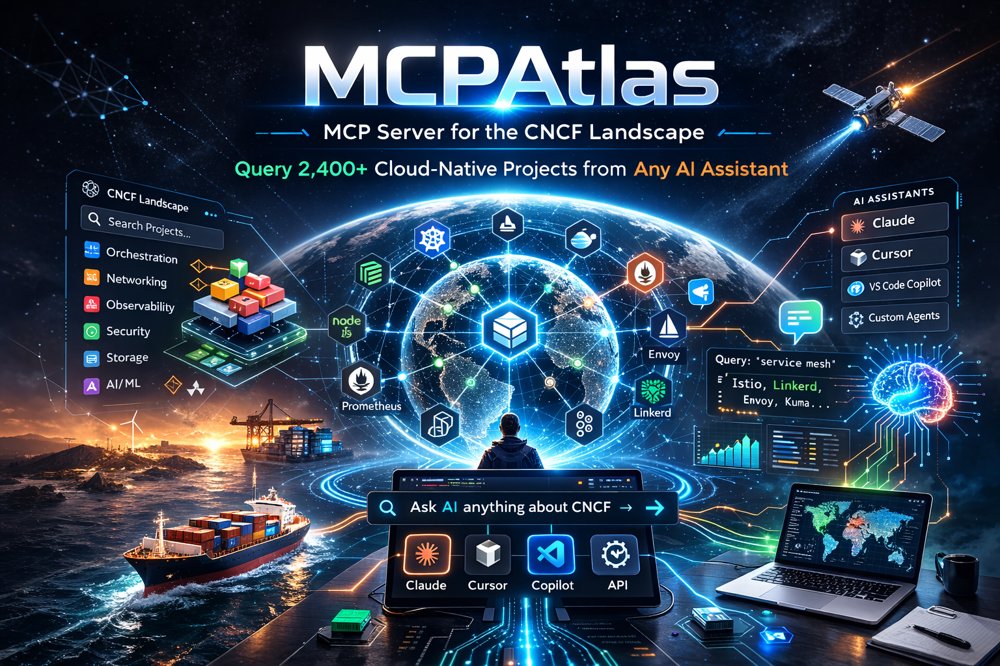
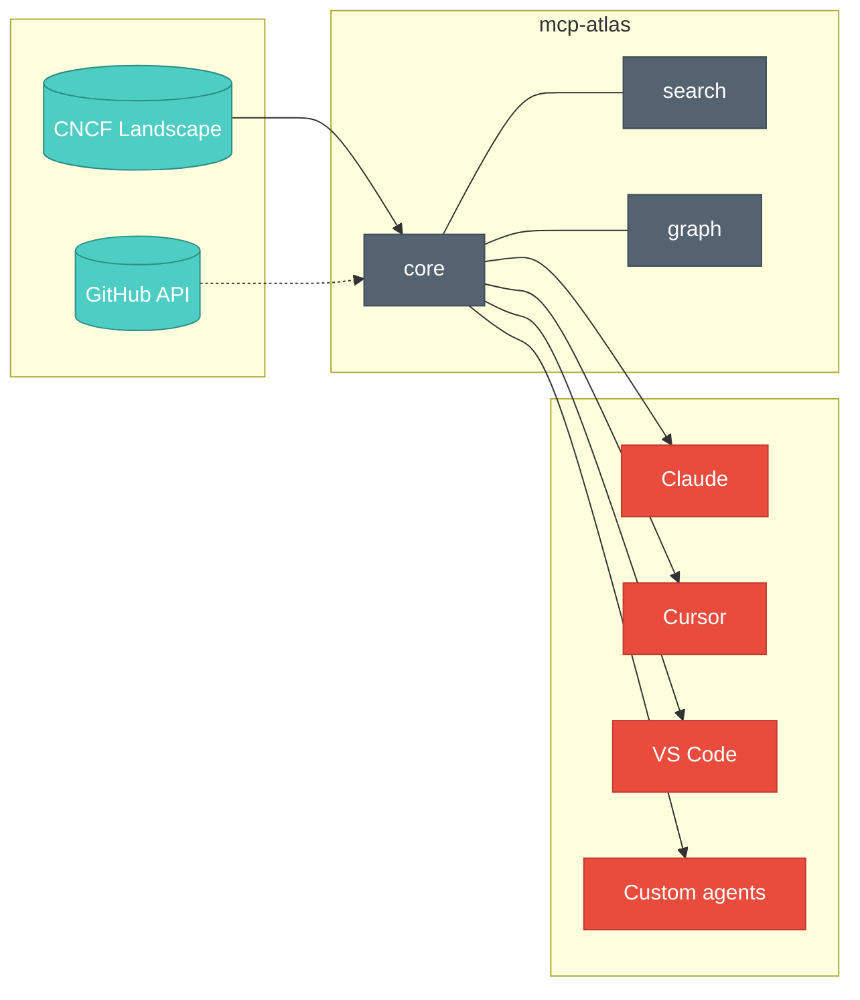
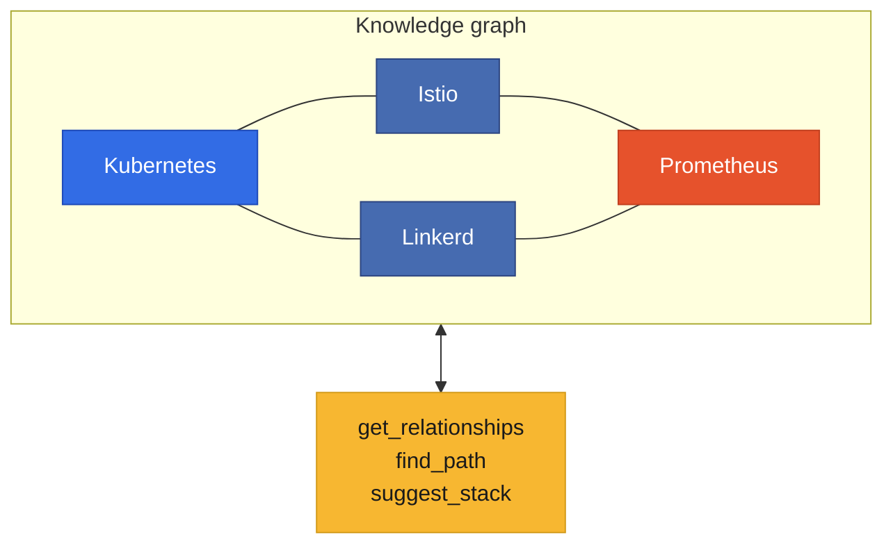

# MCPAtlas

[](https://github.com/aryasoni98/mcpatlas/actions)
[](https://opensource.org/licenses/Apache-2.0)
[](https://www.rust-lang.org/)
[](https://modelcontextprotocol.io/)
[](https://github.com/aryasoni98/mcpatlas/pkgs/container/mcpatlas)
[](https://landscape.cncf.io/)

<p align="center">
  
</p>

**MCP Server for the CNCF Landscape** — Query, compare, and contribute to 2,400+ cloud-native projects from any AI assistant.

An open-source [Model Context Protocol](https://modelcontextprotocol.io/) server that makes the entire [CNCF Landscape](https://landscape.cncf.io/) available to AI tools like Claude, Cursor, VS Code Copilot, and custom agents. Paste a GitHub issue URL and get a compact resolution brief — resolve CNCF issues with AI in fewer turns and fewer tokens.

| Install | Command |
|---------|---------|
| **Docker** | `docker run -p 3000:3000 ghcr.io/aryasoni98/mcpatlas:latest` |
| **Homebrew** | `brew tap aryasoni98/mcpatlas && brew install mcp-atlas` |
| **From source** | `git clone https://github.com/aryasoni98/mcpatlas.git && cd mcpatlas && cargo build --release` |

## Architecture at a glance

Data flows from the landscape into the MCP server; tools, resources, and prompts expose it to AI clients.



How projects connect in the knowledge graph (alternatives, integrations, components):



## Features

### MCP Tools (15)

| Tool | Description |
|------|-------------|
| `search_projects` | Full-text search across all CNCF projects by keyword, category, or maturity |
| `get_project` | Get detailed info for any project (description, GitHub metrics, maturity, links) |
| `compare_projects` | Side-by-side comparison table of multiple projects |
| `list_categories` | Browse all landscape categories and subcategories |
| `get_stats` | Overall landscape statistics |
| `find_alternatives` | Find alternative projects in the same subcategory |
| `get_health_score` | Compute project health from GitHub metrics |
| `suggest_stack` | Recommend a cloud-native stack for a given use case |
| `analyze_trends` | Adoption trends per category (maturity, stars, languages) |
| `get_relationships` | Knowledge graph: alternatives, integrations, components |
| `find_path` | Find the shortest relationship path between two projects |
| `get_graph_stats` | Knowledge graph statistics |
| `get_good_first_issues` | List projects good for contributors (filter by language/category) |
| `get_migration_path` | Migration guide from one project to another |
| `get_issue_context` | Fetch structured context for a GitHub issue — compact brief for AI-assisted resolution |

### MCP Resources

- `cncf://landscape/overview` — High-level landscape statistics
- `cncf://categories/all` — All categories and subcategories
- `cncf://projects/{name}` — Dynamic project details (via resource templates)

### MCP Prompts (4)

- `evaluate_tool` — Deep evaluation of a CNCF tool for your use case
- `plan_migration` — Migration plan from one project to another
- `review_stack` — Review a cloud-native architecture stack
- `onboard_contributor` — Get started contributing to a CNCF project

### Other Capabilities

- **Auto-completion** — Project names, categories, maturity levels, relation types
- **Knowledge graph** — Auto-inferred relationships + 130 curated CNCF integration edges
- **Data caching** — Local JSON cache with configurable TTL (default 24h)
- **Rate limiting** — Configurable concurrency limit for HTTP transport
- **Triple transport** — STDIO (Content-Length framing), HTTP/SSE, and Streamable HTTP (MCP 2025-03-26)
- **Session management** — `Mcp-Session-Id` header for Streamable HTTP sessions
- **CORS** — Browser-friendly cross-origin support for all HTTP endpoints
- **Graceful shutdown** — Clean SIGTERM/SIGINT handling
- **JSON-RPC batching** — Full batch request support per JSON-RPC 2.0 spec §6
- **Logging** — MCP `logging/setLevel` for client-controlled log levels
- **Prometheus metrics** — `/metrics` endpoint with project counts, request stats, uptime
- **Pagination** — Offset-based pagination for search results with `_meta` response
- **Request cancellation** — `notifications/cancelled` with in-flight request tracking
- **Content-Type validation** — 415 Unsupported Media Type for non-JSON POST requests
- **Structured errors** — JSON-RPC error `data` field with tool name in tool call failures
- **Audit logging** — One JSON line per tool call to stderr: `event`, `tool`, `params_hash`, `status`, `latency_ms` (no PII)

## Quick Start

### From Source

```bash
# Clone and build
git clone https://github.com/aryasoni98/mcpatlas.git
cd mcpatlas
cargo build --release

# Run with STDIO transport (for Claude Desktop / Claude Code)
./target/release/mcp-atlas --transport stdio --skip-github

# Run with HTTP transport (for remote clients)
./target/release/mcp-atlas --transport sse --port 3000

# With GitHub enrichment (set token for higher rate limits)
export GITHUB_TOKEN=ghp_...
./target/release/mcp-atlas --transport stdio
```

### Docker

```bash
# Quick run (linux/amd64, linux/arm64)
docker run -p 3000:3000 ghcr.io/aryasoni98/mcpatlas:latest

# With docker-compose (includes health checks and persistent cache)
cd deploy/docker
docker compose up -d
```

### Homebrew

```bash
brew tap aryasoni98/mcpatlas
brew install mcp-atlas
```

### CLI Tool

```bash
# Sync landscape data locally
cargo run -p mcp-atlas-cli -- sync --skip-github

# Search projects
cargo run -p mcp-atlas-cli -- search "service mesh" --data data/landscape.yml

# Inspect a project
cargo run -p mcp-atlas-cli -- inspect Kubernetes --data data/landscape.yml

# Show statistics
cargo run -p mcp-atlas-cli -- stats --data data/landscape.yml

# Show project relationships
cargo run -p mcp-atlas-cli -- graph Kubernetes --data data/landscape.yml

# Validate landscape file
cargo run -p mcp-atlas-cli -- validate data/landscape.yml
```

## Connect to AI Tools

### Claude Desktop / Claude Code

Add to your MCP settings (`~/.claude/settings.json` or Claude Desktop config):

```json
{
  "mcpServers": {
    "cncf-landscape": {
      "command": "mcp-atlas",
      "args": ["--transport", "stdio", "--skip-github"]
    }
  }
}
```

### Cursor / VS Code

```json
{
  "mcp.servers": {
    "cncf-landscape": {
      "url": "http://localhost:3000/mcp"
    }
  }
}
```

### Streamable HTTP (MCP 2025-03-26)

For clients supporting the latest MCP spec:

```bash
# Initialize a session
curl -X POST http://localhost:3000/mcp/stream \
  -H "Content-Type: application/json" \
  -H "Accept: application/json" \
  -d '{"jsonrpc":"2.0","id":1,"method":"initialize","params":{}}'
# Returns Mcp-Session-Id header — include it in subsequent requests

# Use the session
curl -X POST http://localhost:3000/mcp/stream \
  -H "Content-Type: application/json" \
  -H "Mcp-Session-Id: <session-id>" \
  -d '{"jsonrpc":"2.0","id":2,"method":"tools/list","params":{}}'

# SSE streaming (set Accept: text/event-stream)
# DELETE /mcp/stream to terminate a session
```

## Configuration

| Flag | Env Var | Default | Description |
|------|---------|---------|-------------|
| `--transport` | | `stdio` | Transport: `stdio` or `sse` |
| `--port` | | `3000` | Port for SSE transport |
| `--github-token` | `GITHUB_TOKEN` | | GitHub PAT for API enrichment |
| `--landscape-file` | `CNCF_LANDSCAPE_FILE` | | Local landscape.yml path |
| `--skip-github` | | `false` | Skip GitHub metrics enrichment |
| `--cache-dir` | `MCP_ATLAS_CACHE_DIR` | `~/.cache/mcp-atlas` | Cache directory |
| `--max-cache-age` | | `86400` | Cache TTL in seconds |
| `--rate-limit` | | `50` | Max concurrent HTTP requests |
| `--graph-backend` | `MCP_ATLAS_GRAPH_BACKEND` | `mem` | Graph backend: `mem` or `surrealdb` |
| `--artifact-hub` | `MCP_ATLAS_ARTIFACT_HUB` | `false` | Enable Artifact Hub Helm package integration |
| `--qdrant-url` | `MCP_ATLAS_QDRANT_URL` | | Qdrant URL for vector search (enables hybrid search) |
| `--summary-enabled` | `MCP_ATLAS_SUMMARY_ENABLED` | `false` | Enable LLM summaries for projects |

## Architecture

```
mcp-atlas/
├── crates/
│   ├── mcp-atlas-core/      # MCP server, tool handlers, transport
│   ├── mcp-atlas-data/      # Data models, YAML parser, GitHub API, cache
│   ├── mcp-atlas-search/    # Tantivy full-text search index + benchmarks
│   ├── mcp-atlas-graph/     # Knowledge graph engine (relationship inference)
│   ├── mcp-atlas-vector/    # Qdrant + embeddings, hybrid BM25 + vector search
│   ├── mcp-atlas-plugins/   # WASM plugin system (Phase 3)
│   └── mcp-atlas-cli/       # CLI companion tool (9 commands)
├── deploy/
│   └── docker/              # Dockerfile + docker-compose.yml
└── .github/workflows/       # CI + automated data sync
```

## Development

```bash
cargo test --workspace        # Run all tests
cargo clippy --workspace      # Lint
cargo fmt --all               # Format
cargo bench -p mcp-atlas-search # Run search benchmarks

# Dev run with local data
cargo run -p mcp-atlas-cli -- sync --skip-github
cargo run -p mcp-atlas-core -- --transport stdio --landscape-file data/landscape.yml --skip-github
```

## Documentation

The **project site** (landing page and in-app docs) is built and deployed via GitHub Actions (see `.github/workflows/pages.yml`). When GitHub Pages is enabled (Settings → Pages → Source: GitHub Actions), the landing is at `/`, the in-app docs at `/docs`, and the **mdBook** (full user guide) at **`/book`**. The site can also be deployed to **Vercel** (set root to `site`; `vercel.json` is included). Documentation lives in the Vite app at `/docs` (markdown in `site/src/content/docs/`) and in the mdBook at `docs/book/` (Getting Started, Configuration, Tools Reference, Resources, Deployment, Plugin Development, Contributing). To build the landing locally, see [site/README.md](site/README.md). To build the book: `mdbook build docs/book` (output in `docs/book/build/`).

Before a release, run `./scripts/verify-release.sh` from the repo root to verify the site build.

See also [CONTRIBUTING.md](CONTRIBUTING.md), [GOVERNANCE.md](GOVERNANCE.md), [SECURITY.md](SECURITY.md), [ROADMAP.md](ROADMAP.md), and [CODE_OF_CONDUCT.md](CODE_OF_CONDUCT.md).

## Reporting usage

If you use MCPAtlas in production or for significant non-production use, we’d love to hear from you:

- **Adopters:** Add your organization to [ADOPTERS.md](ADOPTERS.md) via a pull request (name + one-line use case).
- **Metrics:** The server exposes Prometheus metrics at `GET /metrics` (request count, latency, tool usage). You can scrape this endpoint for your own dashboards; we do not collect usage data centrally.
- **Feedback:** Open a [GitHub Discussion](https://github.com/aryasoni98/mcpatlas/discussions) for questions, ideas, or success stories.

## License

Apache-2.0
